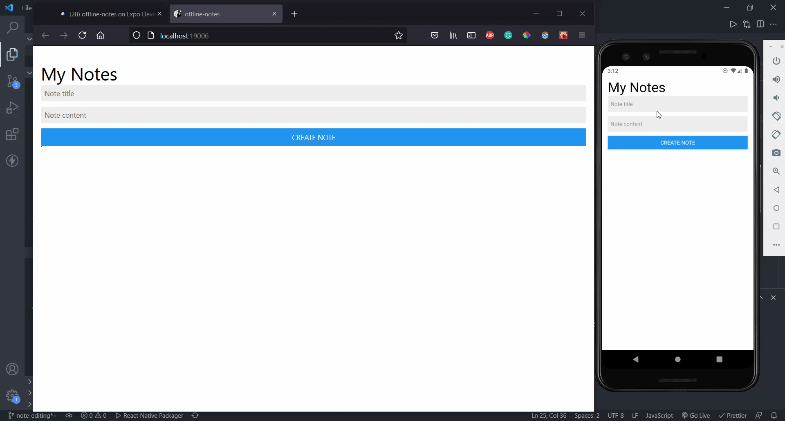

# AWS Notes

This is an offline-first note taking React Native application configured with AWS Amplify. It uses AWS DataStore to perform the online-offline data synchronization.

[APK download](https://ufile.io/7xot14rd)
